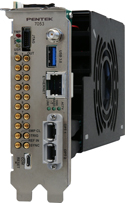
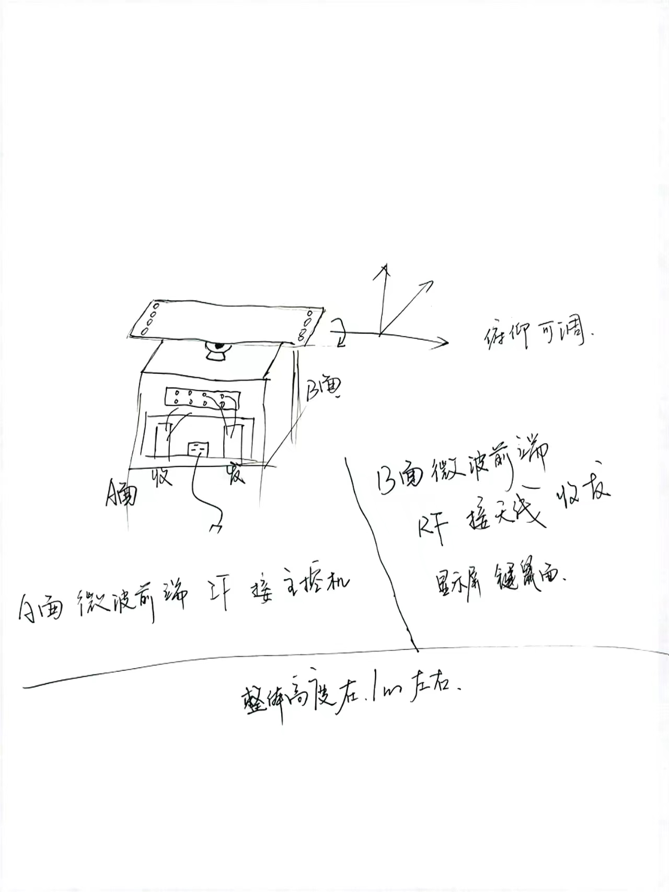

# 新体制连续波地面验证前期汇报

## 实验背景

  传统的成像侦察卫星再区域监视方面存在不足，脉冲雷达存在综合电子威胁、低空、超低空突防威胁、反幅射导弹威胁、隐身目标威胁等四大威胁。连续波SAR具有低截获性、发射峰值功率小，体积小，质量轻，并且不存在脉冲雷达所存在的盲区问题，因而有着广泛的发展前景。

## 实验目的

  对编码连续波的新体制高分宽幅SAR卫星系统的构建研究。基于编码连续波的新体制高分宽幅SAR卫星系统为突破传统星载SAR中幅宽与分辨率之间的制约，需要将连续波、编码、多波束、波束扫描、DBF等多种技术综合应用以突破分辨率与幅宽之间的矛盾。本次实验通过对连续波编码研究，在仿真的基础上通过地面试验对部分关键技术进行验证。
  地面验证主要是利用集成系统通过车载或者轨道进行地面试验，对编码信号的相干性及一致性、天线的隔离与泄漏抑制等相关指标进行验证。环境为野外定标场，验证条件为集成验证系统完成相关测试具备工作条件，在实验平台上安装试验系统。通过对靶标进行辐射，对回波做成像处理对相关指标评估和验证。

## 实验进度

```mermaid
gantt
dateFormat  MM-DD
title 地面验证实验进度表
section 室内验证
微波前端控制:active,a1,02-20,5d

波形验证:crit,active, a3,after a1, 7d
section 室外单通道
角反射器设计与制作:active,b1,02-20,30d
复杂结构体制作:active,b2,02-20,4d
天线支架设计制作:active, a2, 02-20,7d
场地验证:crit,active, b3,after a3, 14d
section 实验MIMO
导轨选型与购买:active, c1,02-20,9d
AD/DA选型与购买:active,c2,02-20,9d
主机选型与购买:active, after c1,3d
系统平台制作:active,c3, after c1,3d
SAR验证:crit,active, after b3, 7d
```

## 地面验证系统

### 设备清单

| 名称 | 数量 | 预算 |
| ---- | ---- | ---- |
|      |      |      |
|      |      |      |
|      |      |      |

### 天线系统

天线系统信号被用于发射或接收系统中，用于辐射和接受电磁波。

实验阶段共使用两种天线系统，第一种为喇叭天线，使用两个X波段的喇叭天线分别作为发射端与接收端。

其型号为HD-100SGAH20N，具体参数为：

| 相关参数    |数值          |
| ----------- | ------------ |
| 工作频率    |8.2-14GHz     |
| 标准增益    |20dB          | 
| E面波束宽度 |11-19°        |
| H面波束宽度 |13-19°        | 
| 外形尺寸    |138×107×245mm |  
| 材料        |铝材          |

喇叭天线应用场景主要为室内测试以及波形测试，需要在云台搭配天线支架，两天线中间放置金属隔离板，并可通过云台调整俯仰角度。

阵列天线采用连续波工作模式，发射4通道，接收4通道。具体参数为：

| 相关参数       | 数值          |
| -------------- | ------------- |
| 工作频率       | 9.6GHz        |
| 收发隔离度     | 129dB         | 
| 俯仰向波束宽度 | 23-27°        |
| 方位向波束宽度 | 28-32°        | 
| 外形尺寸       | 420×1200mm    |  
| 单通道最大功率 | 小于5w        | 

### 微波+AD系统

微波前端是收发系统重要的组成部分，组件将信号进行变频滤波放大后输出

主要特点：

1. 微波前端的发射功率可以以1dB步进调整（衰减/增益）
2. 四通道选通，实现多种发射与接受模式
3. 发射与接收带宽可选，可选带宽为0.3GHz/0.6GHz/1.2GHz

中频与射频测试信号参数如下：

| 相关参数       | 数值          |
| -------------- | ------------- |
| 中频频率       | 1.2GHz        |
| 中频带宽       | 1.2GHz        | 
| 射频频率       | 9.6GHz        |
| 射频频率       | 9.6GHz        | 

接收通道信号参数：

| 相关参数       | 数值          |
| -------------- | ------------- |
| 增益           | 60dB          |
| 噪声系数       | 小于4dB       | 
| 杂散抑制       | 65dB          |
| 关断隔离度     | 90dB          | 
| 镜像抑制       | 60dB          | 
| 功率平坦度     | 约为±1.5dB    |
| 步进衰减范围   | 0-60dB        | 
| 输入驻波       | 1.8           | 
| 输出驻波       | 1.3           | 

发射通道信号参数：

| 相关参数       | 数值          |
| -------------- | ------------- |
| 中频输入功率   | -10dBm        |
| 射频输出功率   | 约为37dBm     |
| 杂散抑制       | 65dB          |
| 关断隔离度     | 90dB          | 
| 镜像抑制       | 60dB          | 
| 带内平坦度     | ±0.5dB        |
| 步进衰减范围   | 0-30dB        | 
| 通道隔离度     | 65dB          | 

#### DA选择

考察德国Spectrum仪器、NI国家仪器、是德科技、pentek等设备商。选用的最低要求为5GSa/s采样率用于生成中频信号。

| Model 7053 8-Channel A/D & D/A Zynq UltraScale+ RFSoC Gen 3 Processor - PCIe | 8CH,     | [Model 7053](https://pentek.com/products/detail.cfm?model=7053) |
| ------------------------------------------------------------ | -------- | ------------------------------------------------------------ |
| Keysight 8195A                                               | 65GSa/s, | [M8195A](https://www.keysight.com.cn/cn/zh/product/M8195A)   |
| 实验室现有8通道DA                                            |          |                                                              |
|                                                              |          |                                                              |
|                                                              |          |                                                              |

### 主机系统

主机系统集成DA信号生成和AD信号采集，并承担微波前端的控制功能。

数据采集需要较大硬盘位和足够的处理速度，因此除了对PCIE插槽有较多需求外，硬盘容量亦应以大容量机械存储+小容量固态搭配。

不考虑工控机/工程机/服务器4U机箱，选用消费级机箱即可，理由如下：

1. 使用场景上，主要是依托导轨平台进行试验，且另外设计机柜搭载机箱、微波前端和天线，对机箱的坚固耐摔及散热方面没有什么要求
2. 实验要求上，尽可能小型化轻型化，4U工控机箱动辄全钢全铝，空机箱重量基本就15kg起步，有点得不偿失。
3. 机箱需求上，并不需要太多硬盘槽位，消费级4*SATA接口足够满足长时间连续波实验。

整体尺寸在50\*40\*30左右。

复用现有机箱亦可，三个PCIE插槽刚好满足要求。

以及一份可供参考的配置表

| 部件         | 型号                                             | 价格    |
| ------------ | ------------------------------------------------ | ------- |
| 处理器       | AMD Ryzen 5 5600X                                | ￥1,999 |
| 主板         | ASUS PRIME B550M-A/CSM                           | ￥1,099 |
| 内存         | Corsair Vengeance LPX 16GB DDR4 3200MHz          | ￥579   |
| 硬盘（系统） | Samsung 970 EVO Plus 500GB NVMe SSD              | ￥899   |
| 硬盘（数据） | Western Digital Blue 4TB SATA HDD                | ￥849   |
| 硬盘（备份） | Seagate Backup Plus Slim 2TB USB 3.0 HDD         | ￥539   |
| 机箱         | Fractal Design Define Mini C                     | ￥679   |
| 电源         | Corsair CX650M 650W 80+ Bronze                   | ￥569   |
| 显示器       | ASUS ZenScreen MB16AC 15.6" Portable USB Monitor | ￥1,999 |
| 合计         |                                                  | ￥9300  |

说明：

1. 处理器：AMD Ryzen 5 5600X，六核心十二线程，频率3.7GHz，搭配Wraith Stealth散热器。
2. 主板：ASUS PRIME B550M-A/CSM，B550芯片组，支持PCIe 4.0，M.2 NVMe接口。
3. 内存：Corsair Vengeance LPX 16GB DDR4 3200MHz，单根内存，延迟16-18-18-36。
4. 硬盘（系统）：Samsung 970 EVO Plus 500GB NVMe SSD，读取速度3500MB/s，写入速度3300MB/s，提供快速的系统启动和应用程序加载速度。
5. 硬盘（数据）：Western Digital Blue 4TB SATA HDD，7200转，64MB缓存，提供大容量的数据存储空间。
6. 硬盘（备份）：Seagate Backup Plus Slim 2TB USB 3.0 HDD，支持USB 3.0接口，提供便携式的备份和存储解决方案。
7. 机箱：Fractal Design Define Mini C，ATX中塔机箱，内置两个120mm风扇，静音性能优秀。
8. 电源：Corsair CX650M 650W 80+ Bronze，650瓦电源，80+ Bronze认证，稳定可靠。
9. 显示器：ASUS ZenScreen MB16AC 15.6" Portable USB Monitor，15.6英寸便携式显示器，分辨率为1920x

### 供电系统

供电系统目的是为了提供给主机、导轨、微波前端、AD/DA等设备电源。

由于涉及到外场试验，需要有额外的发电源，现有两个备选方案：大型锂电移动电源与小型汽油发电机

市面上的大型锂电移动电源的额定功率约为1200w,最大型号可以达到1500w(电池容量1960wh),尺寸为190×320×190mm，重量约为10kg。

小型汽油发电机，额定功率约为3000w,机身重21kg，另配有4L油箱，额定电流10.8A，尺寸480×290×440mm。

虽然锂电移动电源的体积小，重量轻。相比汽油发电机更加方便，但若使用消费级机箱作为主机，在高负载情况下功率约为600w，另外加上微波前端、移动导轨、显示屏以及其他硬件的供电，1500w额定功率的移动电源可能没法满足需要，需要购买2-3块，经济花费相差无几，甚至移动移动电源开销高于汽油发动机。

此外，若长期在外场试验，锂电池需要8-10小时才可从零电量充满至满电量，不方便续航，而柴油发动机只需要准备备用的汽油，便可完成超长时间的续航，有更强的供电稳定性。

### 结构系统

结构系统的目的是支撑和连接下层ATX中塔机箱和上层微波前端、天线和显示屏，以实现雷达地面验证系统的数据采集、信号生成和显示功能。

结构系统主要由以下组成部分构成：

1. 定制机柜：用于放置下层的ATX中塔机箱、采集卡和信号生成板卡、显示屏，以及上层的微波前端，天线和机械结构。机柜需要具备较强的承载能力、抗震性能和防尘防水等特性，以适应复杂的使用环境。
2. ATX中塔机箱：用于安装采集卡和信号生成板卡，以提供数据采集和信号生成功能。塔式机箱可以提供较大的内部空间和通风能力，以保证高性能硬件的正常运行。
3. 采集卡和信号生成板卡：用于实现雷达信号的生成和采集功能。这些卡片需要通过8根线缆与微波前端相连，以传输数据和控制信号。
4. 显示屏：用于显示雷达地面验证系统的采集数据和实时结果。显示屏需要与机柜相连，以接收来自机箱内部的视频信号。
5. 微波前端：用于接收来自天线的雷达信号，并将信号传输到机柜内部的采集卡和信号生成板卡。微波前端需要与机柜相连，以传输数据和控制信号。
6. 天线：用于接收雷达信号并将其传输到微波前端，需要支持8个通道的信号输入。天线需要通过机械结构支撑在机柜上方，以确保天线的稳定性和精度。
7. 机械结构：用于支撑机柜上方的天线，并提供天线的俯仰可调功能。机械结构需要具备足够的刚性和稳定性，以保证天线的准确性和稳定性。

综上所述，结构系统是支撑和连接雷达地面验证系统各个功能模块的重要组成部分，通过合理的设计和安装，可以提高系统的性能和可靠性，保证数据采集和信号生成的准确性和稳定性。

简单示意图

### 运动系统

考虑到实际卫星的脉冲重复频率（约2000Hz）与卫星飞行速度（约7公里每秒），以及天线的尺寸、方向和场景的大小，初步设计为：
1、30米长，带有约1m*0.78m的轨道车，载重量约为200kg，轨道车的最大运行速度为3m/s。考虑到安全性与平台的稳定性，拟使用小推车与发电机组合的形式给系统供电。考察一个合成孔径时间内雷达对靶标的成像质量。
2.半径5米，其余条件同上，围绕一个靶标进行照射。验证合成孔径数量对成像质量的影响。
一共约60米的轨道，每米约250元，发电机一台。

### 靶标系统

靶标系统的目的是为雷达地面验证实验提供探测目标，通过对靶标的测量数据，验证雷达性能和算法的准确性和可靠性。靶标通常是高反射性金属材料，以反射雷达信号，以提供检测雷达探测效果的评估。

在这个雷达地面验证实验中，靶标系统是一个非常重要的组成部分。三个仿造舰船目标的复杂结构体，尺寸在2m\*1m\*1m左右，可以模拟实际目标，提高实验的真实性和可靠性。两个大号角反射器，边长1m，前期收发验证。

因此，靶标系统的意义在于提供真实的目标仿真，帮助验证雷达系统在不同的环境和条件下的探测性能，以及评估雷达系统的性能和算法的可靠性和有效性。

基于美国福特级航母、阿利伯克IIA级驱逐舰及圣安东尼奥两栖登陆舰来制作复杂结构体，三种军舰均有自己非常独特的舰岛结构，参考图如下：

福特级航母舰岛尺寸为__\*__，单体

阿利伯克级驱逐舰舰岛尺寸为__\*__，双舰岛

圣安东尼奥级两栖登陆舰的上层构造分为前、后两部分，前部船楼包含舰桥、前部AEM/S桅杆以及一号烟囱等，后部船楼包含机库、库房、后部烟囱以及后部AEM/S桅杆等，两船楼之间的空隙也由两侧舷墙包围，中间形成的天井空间可用来停放小艇，而且侧面受到舷墙遮蔽，可降低雷达截面积（RCS）。
